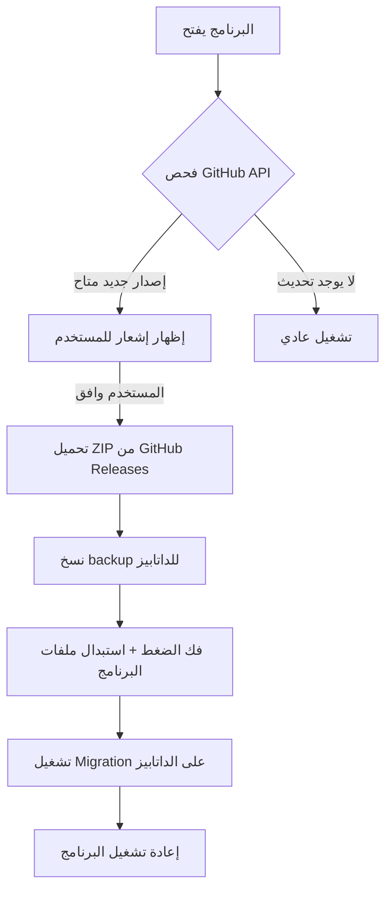

# 🔄 خطة التحديث التلقائي عبر GitHub — Smart Murabha

## المشكلة
عند إرسال إصدار جديد للفروع، نحتاج:
1. أن يعرف البرنامج تلقائياً أن في تحديث جديد.
2. أن التحديث يتم بدون فقد بيانات الفرع (الداتابيز).
3. أن أي تغييرات في الـ Schema تُطبق تلقائياً على الداتابيز الموجودة.

---

## الحل المقترح: 3 طبقات



---

## الطبقة 1: فحص التحديثات (Update Check)

### الآلية
- عند فتح البرنامج، يتم استدعاء **GitHub Releases API** للمقارنة مع الإصدار الحالي.
- الـ API لا يحتاج مفتاح (public repo) أو يحتاج Personal Access Token (private repo).

### التنفيذ المقترح

```typescript
// electron/src/updater.ts
import { app, dialog, shell } from 'electron';
import https from 'https';
import path from 'path';

const GITHUB_OWNER = 'your-username';
const GITHUB_REPO  = 'V2_Murabha';
const CURRENT_VERSION = app.getVersion(); // يقرأ من package.json

interface GithubRelease {
  tag_name: string;
  name: string;
  body: string;
  assets: { name: string; browser_download_url: string }[];
}

export async function checkForUpdates(): Promise<void> {
  try {
    const release = await fetchLatestRelease();
    const remoteVersion = release.tag_name.replace('v', '');
    
    if (isNewerVersion(remoteVersion, CURRENT_VERSION)) {
      const result = await dialog.showMessageBox({
        type: 'info',
        title: 'تحديث متاح',
        message: `يوجد إصدار جديد: ${release.tag_name}`,
        detail: release.body || 'تحسينات وإصلاحات',
        buttons: ['تحديث الآن', 'لاحقاً'],
        defaultId: 0,
      });

      if (result.response === 0) {
        // فتح رابط التحميل مباشرة أو بدء التحميل التلقائي
        const zipAsset = release.assets.find(a => a.name.endsWith('-win.zip'));
        if (zipAsset) {
          shell.openExternal(zipAsset.browser_download_url);
        }
      }
    }
  } catch (err) {
    console.log('Update check failed (offline?):', err);
  }
}
```

### مقارنة الإصدارات

```typescript
function isNewerVersion(remote: string, current: string): boolean {
  const r = remote.split('.').map(Number);
  const c = current.split('.').map(Number);
  for (let i = 0; i < Math.max(r.length, c.length); i++) {
    if ((r[i] || 0) > (c[i] || 0)) return true;
    if ((r[i] || 0) < (c[i] || 0)) return false;
  }
  return false;
}
```

---

## الطبقة 2: التحديث بدون فقد البيانات

> [!IMPORTANT]
> **القاعدة الذهبية:** الداتابيز (`dev.db`) لا تُشحن مع التحديث. التحديث يستبدل **الكود فقط**.

### الوضع الحالي (المشكلة)
حالياً، الداتابيز مُحزمة داخل `extraResources/backend/prisma/dev.db` — أي أن كل تحديث يستبدلها بداتابيز فارغة!

### الحل: فصل مسار الداتابيز عن مسار البرنامج

```
📁 مجلد البرنامج (يتم استبداله بالكامل عند التحديث)
├── Smart_Murabha.exe
├── resources/
│   ├── backend/prisma/schema.prisma   ← الشكل فقط
│   ├── backend/prisma/migrations/     ← ملفات الترحيل
│   └── frontend/                      ← واجهة المستخدم

📁 مجلد البيانات (لا يُمس أبداً عند التحديث)
├── %APPDATA%/Smart_Murabha/
│   ├── dev.db                         ← بيانات الفرع
│   ├── dev.db-wal
│   └── backups/                       ← نسخ احتياطية تلقائية
```

### التعديل المطلوب في `main.ts`

```typescript
// بدلاً من:
const dbPath = path.join(backendResourcesDir, 'prisma', 'dev.db');

// نستخدم:
function getDbPath(): string {
  const userDataDir = app.getPath('userData'); // %APPDATA%/Smart_Murabha
  const dbDir = path.join(userDataDir, 'data');
  
  // إنشاء المجلد لو مش موجود
  if (!fs.existsSync(dbDir)) fs.mkdirSync(dbDir, { recursive: true });
  
  const dbPath = path.join(dbDir, 'dev.db');
  
  // أول مرة فقط: نسخ الداتابيز الأولية من الموارد
  if (!fs.existsSync(dbPath)) {
    const seedDb = path.join(getBackendResourcesDir(), 'prisma', 'dev.db');
    if (fs.existsSync(seedDb)) {
      fs.copyFileSync(seedDb, dbPath);
    }
  }
  
  return dbPath;
}
```

> [!CAUTION]
> هذا التغيير يجب أن يتم **قبل** إرسال أي نسخة للفروع، لأن بعد تطبيقه سيتغير مسار الداتابيز من `resources/` إلى `%APPDATA%/`.

---

## الطبقة 3: ترحيل الداتابيز (Schema Migrations)

### المشكلة
لو أضفنا حقل جديد (مثلاً `customerGroup` في جدول `Customer`)، الداتابيز الموجودة عند الفرع لن تحتوي عليه.

### الحل: نظام ترحيل يدوي بـ SQL

> [!WARNING]
> **لا نستخدم `prisma migrate`** في الإنتاج مع SQLite لأنه:
> - يحتاج Prisma CLI مُثبت على جهاز الفرع
> - قد يفشل بدون إنترنت
> - صعب التحكم فيه في بيئة مُحزمة (packaged)

### الحل البديل: ملف ترحيل SQL يعمل عند بدء التشغيل

```typescript
// backend/src/migrator.ts
import { PrismaClient } from '@prisma/client';

interface Migration {
  version: string;
  description: string;
  sql: string[];
}

const MIGRATIONS: Migration[] = [
  {
    version: '1.0.1',
    description: 'إضافة نوع العميل',
    sql: [
      // لا شيء — هذا الإصدار الأساسي
    ]
  },
  {
    version: '1.0.2',
    description: 'إضافة مجموعة العميل',
    sql: [
      `ALTER TABLE Customer ADD COLUMN customerGroup TEXT DEFAULT 'أساسي';`,
      `CREATE INDEX IF NOT EXISTS idx_customer_group ON Customer(customerGroup);`,
    ]
  },
  {
    version: '1.0.3',
    description: 'إضافة حقل الخصم على القسط',
    sql: [
      `ALTER TABLE Installment ADD COLUMN discount DECIMAL DEFAULT 0;`,
    ]
  },
];

export async function runMigrations(prisma: PrismaClient): Promise<void> {
  // إنشاء جدول تتبع الترحيل لو مش موجود
  await prisma.$executeRawUnsafe(`
    CREATE TABLE IF NOT EXISTS _app_migrations (
      version TEXT PRIMARY KEY,
      applied_at TEXT DEFAULT (datetime('now'))
    );
  `);

  // تحديد الترحيلات المطبقة
  const applied = await prisma.$queryRawUnsafe<{version: string}[]>(
    `SELECT version FROM _app_migrations`
  );
  const appliedSet = new Set(applied.map(m => m.version));

  // تطبيق الترحيلات الجديدة
  for (const migration of MIGRATIONS) {
    if (appliedSet.has(migration.version)) continue;
    
    console.log(`🔄 Applying migration ${migration.version}: ${migration.description}`);
    
    for (const sql of migration.sql) {
      try {
        await prisma.$executeRawUnsafe(sql);
      } catch (err: any) {
        // تجاهل "column already exists" لأنها تعني أن الترحيل مُطبق فعلاً
        if (err.message?.includes('duplicate column')) continue;
        throw err;
      }
    }

    await prisma.$executeRawUnsafe(
      `INSERT INTO _app_migrations (version) VALUES ('${migration.version}')`
    );
    console.log(`✅ Migration ${migration.version} applied successfully`);
  }
}
```

### الاستدعاء عند بدء التشغيل

```typescript
// في backend/src/index.ts — قبل app.listen()
import { runMigrations } from './migrator.js';

await runMigrations(prisma);
```

---

## سيناريوهات الـ Schema المتوقعة

| السيناريو | SQL المطلوب | المخاطر |
|---|---|---|
| **إضافة عمود جديد** | `ALTER TABLE X ADD COLUMN y TYPE DEFAULT val` | ✅ آمن تماماً |
| **إضافة جدول جديد** | `CREATE TABLE IF NOT EXISTS ...` | ✅ آمن تماماً |
| **إضافة Index** | `CREATE INDEX IF NOT EXISTS ...` | ✅ آمن تماماً |
| **تغيير اسم عمود** | `ALTER TABLE X RENAME COLUMN old TO new` | ⚠️ يحتاج SQLite 3.25+ |
| **حذف عمود** | **غير ممكن مباشرة في SQLite** | 🔴 يحتاج إعادة إنشاء الجدول |
| **تغيير نوع عمود** | **غير ممكن مباشرة في SQLite** | 🔴 يحتاج إعادة إنشاء الجدول |

> [!TIP]
> **القاعدة:** صمم الـ Schema بحيث التغييرات تكون **إضافة فقط** (Additive Only). تجنب الحذف أو تغيير الأنواع قدر الإمكان.

---

## خطوات التنفيذ (بالترتيب)

### المرحلة 1: فصل الداتابيز ✦ أولوية قصوى
1. تعديل `main.ts` لاستخدام `%APPDATA%` بدلاً من `resources/`.
2. إضافة منطق النسخ الأولي للداتابيز.
3. تعديل `electron-builder.json` لإزالة `dev.db` من `extraResources`.

### المرحلة 2: نظام الترحيل
4. إنشاء `migrator.ts` مع جدول `_app_migrations`.
5. استدعاء `runMigrations()` عند بدء التشغيل.
6. اختبار على داتابيز قديمة.

### المرحلة 3: فحص التحديثات
7. إنشاء `updater.ts` مع استدعاء GitHub API.
8. إضافة زر "فحص التحديثات" في صفحة الإعدادات.
9. رفع أول Release على GitHub.

### المرحلة 4 (اختياري): تحديث تلقائي بالكامل
10. استخدام `electron-updater` مع `nsis` target بدلاً من `zip`.
11. التحديث يتم في الخلفية بدون تدخل المستخدم.

---

## ملاحظات مهمة

> [!WARNING]
> **Private Repo:** لو الريبو private، ستحتاج لتضمين GitHub Personal Access Token في البرنامج أو استخدام خادم وسيط (proxy) للتحقق من التحديثات.

> [!NOTE]
> **النسخ الاحتياطي التلقائي:** قبل أي ترحيل، يجب عمل نسخة من الداتابيز في مجلد `backups/` مع طابع زمني. هذا يضمن إمكانية التراجع في حالة فشل الترحيل.

> [!TIP]
> **أفضل ممارسة:** كل إصدار جديد يجب أن يحتوي على رقم ترحيل (`migration version`) مطابق لرقم الإصدار. هذا يربط الكود بالداتابيز بشكل واضح.
